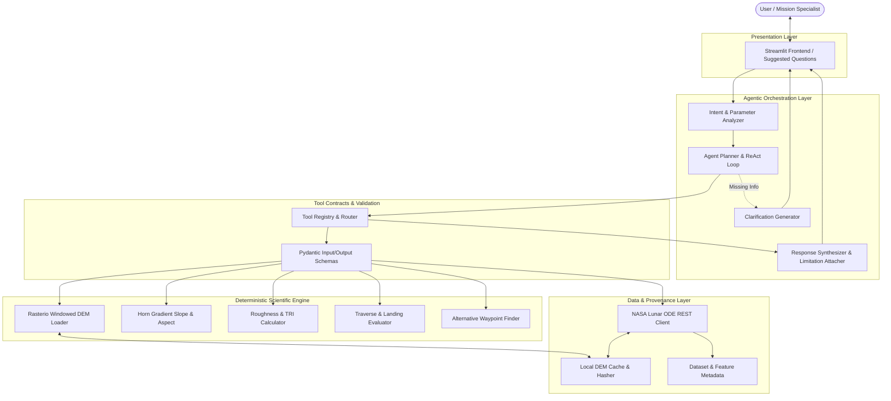
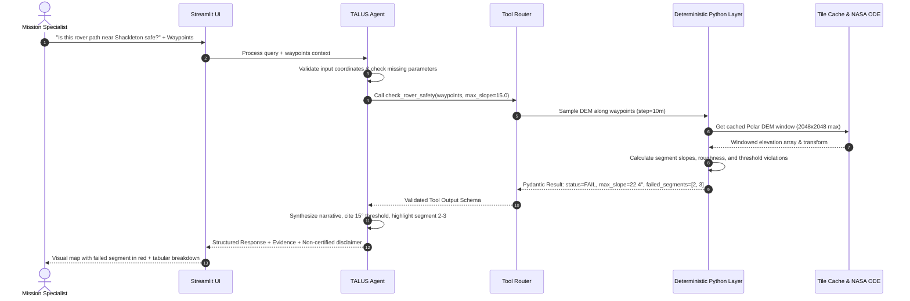

# TALUS System Architecture

Terrain Analysis for Landing and Uncrewed Systems (TALUS) is designed as a modular, agent-driven scientific analysis platform. It combines agentic reasoning with strict deterministic geospatial calculation pipelines.

> [!IMPORTANT]
> **Operational Status**: TALUS is a research and technology demonstration system. It must **NEVER** claim to provide certified flight safety, operational landing approval, autonomous spacecraft control, or guaranteed rover safety.

---

## 1. Architectural Principles

1. **Separation of Concerns**:
   - **LLM Agent**: Responsible for natural language understanding, mission goal decomposition, tool orchestration, parameter clarification, and narrative synthesis.
   - **Deterministic Python Engine**: Solely responsible for all numerical computations (elevations, slope gradients, terrain roughness, traverse risk, distance metrics).
2. **Resource-Constrained Execution**:
   - Designed for standard CPU environments.
   - Enforces windowed raster reads via Rasterio ($\le 2048 \times 2048$ cells), bounded memory allocation, and disk-backed tile caching.
3. **Decoupled Service Layer**:
   - The core engine in `src/terrain_agent/` is completely decoupled from presentation logic.
   - Supports Streamlit as the primary interactive MVP interface, and enables direct wrapping in a FastAPI REST/WebSocket service without refactoring.
4. **Resilient & Secretless Startup**:
   - Zero credentials are required to start the application.
   - Local sample datasets and mock providers enable offline testing and continuous integration without external network access or paid API keys.

---

## 2. System Component Diagram



---

## 3. The Core Tool Suite

Each tool is wrapped with a strict Pydantic input schema, validated output schema, execution timeout, structured logging, and resource safety guardrails:

| Tool Name | Purpose | Deterministic Operations | Input Parameters | Output Summary |
| :--- | :--- | :--- | :--- | :--- |
| `search_lunar_dem` | Discover available DEMs | Coordinates check, NASA ODE query filter | Lat/Lon bounds, min resolution, target feature | Candidate DEM products with metadata |
| `download_dem_tile` | Fetch & cache DEM tile | Domain allowlist verification, size check, hash storage | Product ID, download URL, target sub-window | Local raster file path, CRS, bounding box |
| `get_dem_stats` | Terrain characterization | Windowed elevation min/max/mean/std, Horn slope | DEM file or bounds, center lat/lon, radius_km | Elevation statistics, slope histogram, resolution |
| `find_safe_regions` | Landing site screening | Masking by slope $\le \theta$, roughness $\le R$, area filter | Center coords, search radius, max slope, min contiguous area | Safe candidate polygons, centroid coordinates, mean slope |
| `check_rover_safety` | Traverse risk assessment | Path interpolation, segment slope, roughness along line | List of waypoints, max configured slope, vehicle clearance | PASS/REVIEW_REQUIRED/FAIL, failing segments, max slope |
| `dataset_information` | Provenance & limitations | Metadata retrieval, scientific resolution & accuracy specs | Dataset name or product ID | Dataset specs, vertical accuracy, limitations |

---

## 4. Execution Workflow: Example Query



---

## 5. Extensibility to FastAPI

The project is structured such that `src/terrain_agent` contains zero Streamlit dependencies:
```
# Future API exposure without modifying core logic:
from fastapi import FastAPI
from terrain_agent.agent.planner import LunarTerrainAgent
from terrain_agent.schemas.tools import RoverSafetyRequest, RoverSafetyResponse

app = FastAPI(title="TALUS API")
agent = LunarTerrainAgent()

@app.post("/api/v1/safety/rover", response_model=RoverSafetyResponse)
async def check_rover(request: RoverSafetyRequest):
    return agent.tools.check_rover_safety(request)
```
